<h1 align="center">Strapi - Better Blocks Plugin</h1>

<p align="center">An enhanced Rich Text (Blocks) editor for Strapi v5 with inline text color, background highlight, and more.</p>

<p align="center">
  <a href="https://www.npmjs.com/package/@k11k/strapi-plugin-better-blocks">
    
  </a>
  <a href="https://www.npmjs.com/package/@k11k/strapi-plugin-better-blocks">
    
  </a>
  <a href="https://github.com/k11k-labs/strapi-plugin-better-blocks/blob/main/LICENSE">
    
  </a>
</p>

<p align="center">
  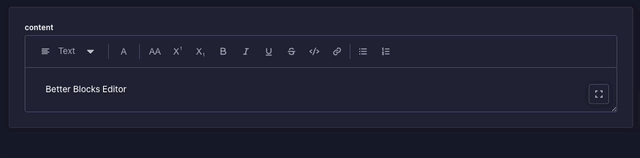
</p>

---

## Table of Contents

1. [Features](#features)
2. [Compatibility](#compatibility)
3. [Installation](#installation)
4. [Configuration](#configuration)
5. [Usage](#usage)
6. [Custom Color Presets](#custom-color-presets)
7. [Media Embeds (CSP Configuration)](#media-embeds-csp-configuration)
8. [Frontend Rendering](#frontend-rendering)
9. [Contributing](#contributing)
10. [License](#license)

---

## Feature showcase

### Text color & background highlight

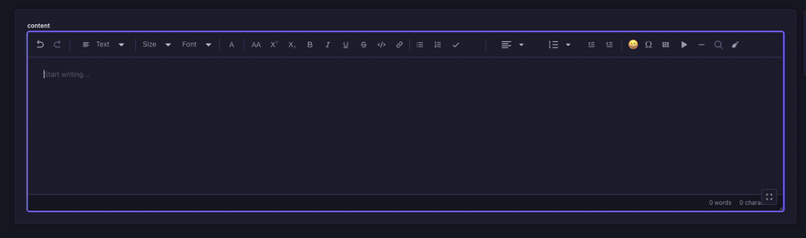

### Tables

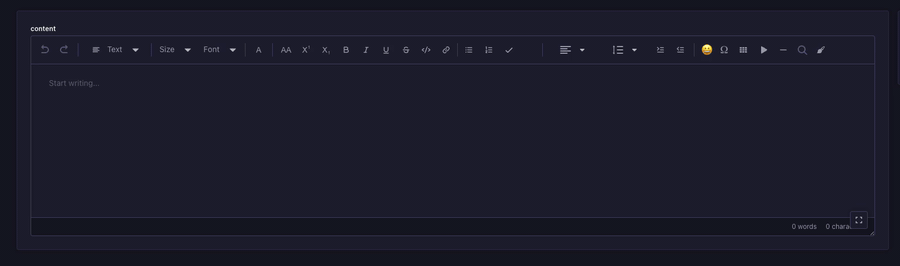

### Nested lists

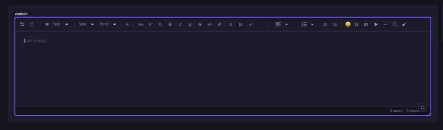

### Media embeds (YouTube / Vimeo)

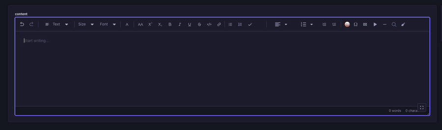

### Text alignment

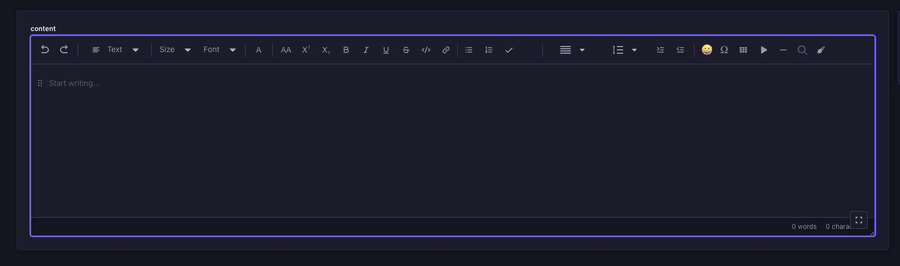

### Line height & indentation

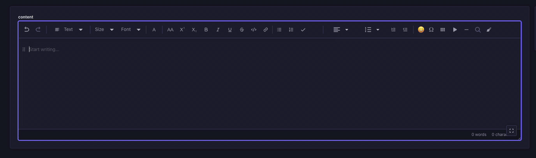

### Image captions & alignment

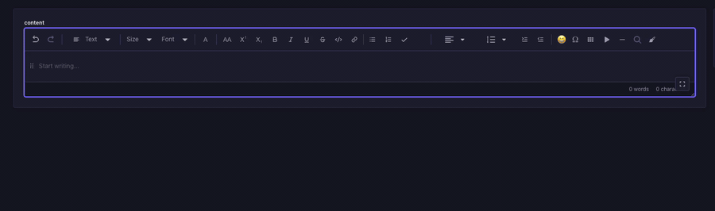

### Emoji & special character pickers

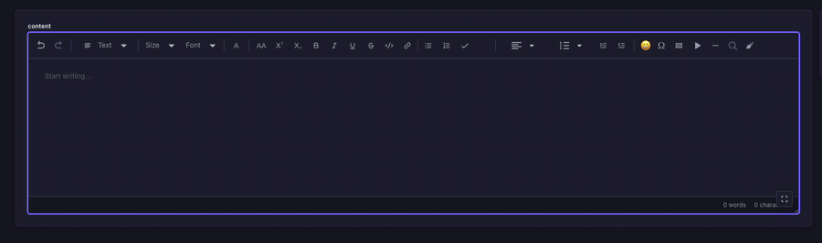

### Find & replace

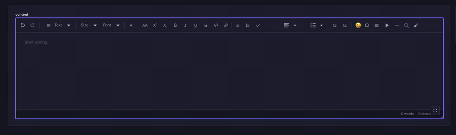

### Undo / redo, remove formatting & word count

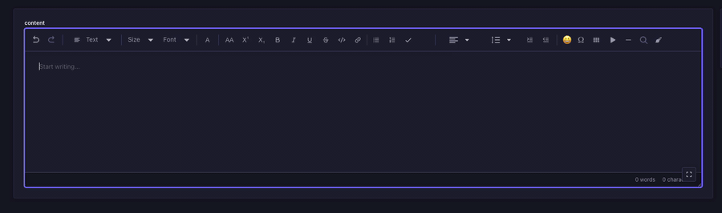

## Features

- **Inline Text Color** &mdash; Apply foreground color to selected text from a configurable palette
- **Background Highlight** &mdash; Apply background color to selected text for highlighting
- **Live Preview Button** &mdash; The toolbar button reflects the currently active text and highlight colors
- **Customizable Palettes** &mdash; Define custom color presets per field via Content-Type Builder
- **Dark & Light Mode** &mdash; Fully compatible with both Strapi themes
- **Drop-in Replacement** &mdash; Works as a custom field alongside the native Rich Text (Blocks) field
- **Nested Lists** &mdash; Infinitely nestable ordered and unordered lists with per-level format switching (Tab to indent, Shift+Tab to outdent)
- **To-do Lists** &mdash; Checkbox list items with click-to-toggle and strikethrough on checked items
- **Tables** &mdash; Insert tables with header row, add/remove rows and columns via hover toolbar
- **Media Embeds** &mdash; Insert YouTube and Vimeo videos with thumbnail preview in editor (iframe on frontend)
- **Horizontal Line** &mdash; Insert `<hr>` dividers between content blocks
- **Text Alignment** &mdash; Per-block left, center, right, and justify alignment
- **Undo / Redo** &mdash; Toolbar buttons wired to Slate's built-in history
- **Remove Formatting** &mdash; One-click button to strip all marks from selected text
- **Link Decorators** &mdash; "Open in new tab" option with `target="_blank"` and `rel="noopener noreferrer"`
- **Word & Character Count** &mdash; Live counter displayed at the bottom of the editor
- **Line Height** &mdash; Per-block line spacing control (1, 1.15, 1.5, 2, 2.5, 3)
- **Indent / Outdent** &mdash; Block-level indentation buttons (up to 6 levels)
- **Image Captions** &mdash; Editable figcaption below images
- **Image Alignment** &mdash; Left, center, and right alignment for images via hover buttons
- **Emoji Picker** &mdash; Searchable popup grid with 130+ common emojis
- **Special Characters** &mdash; Categorized picker for currency, math, arrows, Greek, legal symbols and more
- **Find and Replace** &mdash; Search with real-time highlighting (yellow for all matches, orange for active), prev/next navigation, replace and replace all
- **Font Family** &mdash; Inline font family selector (Arial, Georgia, Times New Roman, and more)
- **Font Size** &mdash; Inline font size selector (10px to 48px)
- **Slash Commands** &mdash; Type `/` to open a block insertion menu with search, arrow key navigation, and Enter to select
- **Auto Text Transformations** &mdash; Automatic symbol replacement on space: `(c)` &rarr; &copy;, `1/2` &rarr; &frac12;, `--` &rarr; &mdash;, `->` &rarr; &rarr;, and more
- **Editor Placeholder** &mdash; "Start writing..." placeholder shown when the editor is empty
- **Responsive Toolbar** &mdash; Wraps to multiple rows on smaller screens so all buttons remain accessible
- **Full Blocks Editor** &mdash; Paragraphs, headings, lists, links, quotes, code blocks, and all standard text modifiers (bold, italic, underline, strikethrough, code, uppercase, superscript, subscript)

## Compatibility

| Strapi Version | Plugin Version |
| -------------- | -------------- |
| v5.x           | v0.1.x         |

## Installation

```bash
# Using yarn
yarn add @k11k/strapi-plugin-better-blocks

# Using npm
npm install @k11k/strapi-plugin-better-blocks
```

After installation, rebuild your Strapi admin panel:

```bash
yarn build
# or
npm run build
```

## Configuration

### 1. Enable the plugin

Add the plugin to your Strapi configuration in `config/plugins.ts` (or `config/plugins.js`):

```ts
// config/plugins.ts
export default () => ({
  'better-blocks': {
    enabled: true,
  },
});
```

### 2. Restart Strapi

```bash
yarn develop
```

### 3. Add a Better Blocks field

1. Go to **Content-Type Builder**
2. Select or create a content type
3. Click **Add new field**
4. Switch to the **CUSTOM** tab
5. Select **Better Blocks**
6. Configure the field name and color settings
7. Save and wait for Strapi to restart

## Usage

Once added to a content type, the Better Blocks field provides an enhanced Rich Text editor with:

### Text Color

1. Select text in the editor
2. Click the **A** button in the toolbar
3. Switch to the **Text** tab
4. Choose a color from the palette
5. Click **Remove color** to reset

### Background Highlight

1. Select text in the editor
2. Click the **A** button in the toolbar
3. Switch to the **Highlight** tab
4. Choose a background color from the palette
5. Click **Remove highlight** to reset

The toolbar button shows a live preview of the active colors &mdash; the icon color reflects the text color, and the button background reflects the highlight color.

## Custom Color Presets

You can customize both text and background color palettes per field in the Content-Type Builder:

### Text Colors

In the field's **Base settings**:

- **Disable default text colors** &mdash; Check to replace default colors with your own
- **Custom text color presets** &mdash; One color per line in `Label:#HEX` format

Example:

```
Black:#000000
White:#FFFFFF
Brand Red:#E53E3E
Brand Blue:#3182CE
```

### Background Colors

- **Disable default background colors** &mdash; Check to replace default highlights with your own
- **Custom background color presets** &mdash; One color per line in `Label:#HEX` format

Example:

```
Warning:#FED7D7
Info:#BEE3F8
Success:#C6F6D5
Neutral:#EDF2F7
```

### Default Palettes

**Text colors:** Teal, Dark, Gray, Light Gray, Silver, Medium Gray, White

**Background colors:** Yellow, Green, Blue, Pink, Purple, Orange, Gray, Teal, Red, Cyan

## Media Embeds (CSP Configuration)

If you use the **media embed** feature (YouTube / Vimeo), you need to update your Strapi security middleware to allow loading thumbnails and video iframes.

In `config/middlewares.ts`:

```ts
export default [
  'strapi::logger',
  'strapi::errors',
  {
    name: 'strapi::security',
    config: {
      contentSecurityPolicy: {
        directives: {
          'img-src': ["'self'", 'data:', 'blob:', 'https://img.youtube.com'],
          'media-src': ["'self'", 'data:', 'blob:'],
          'frame-src': [
            "'self'",
            'https://www.youtube.com',
            'https://player.vimeo.com',
          ],
        },
      },
    },
  },
  'strapi::cors',
  'strapi::poweredBy',
  'strapi::query',
  'strapi::body',
  'strapi::session',
  'strapi::favicon',
  'strapi::public',
];
```

Without this, YouTube thumbnails will be blocked by the Content Security Policy in the Strapi admin panel. The `frame-src` directive is needed if you render the embeds as iframes on your frontend while previewing in Strapi.

## Frontend Rendering

To render Better Blocks content in your React frontend, use the companion renderer:

```bash
# Using yarn
yarn add @k11k/better-blocks-react-renderer

# Using npm
npm install @k11k/better-blocks-react-renderer
```

```tsx
import { BlocksRenderer } from '@k11k/better-blocks-react-renderer';

const MyComponent = ({ content }) => {
  return <BlocksRenderer content={content} />;
};
```

The renderer supports all Better Blocks features including text colors, background highlights, images, and all standard block types.

See the [@k11k/better-blocks-react-renderer](https://github.com/k11k-labs/better-blocks-react-renderer) repository for full documentation.

## Requirements

- **Node.js** &ge; 20.0.0
- **Strapi** v5.x
- **Slate** 0.94.1 (bundled with Strapi)

## Contributing

Contributions are welcome! The easiest way to get started is with Docker:

```bash
# Clone the repository
git clone https://github.com/k11k-labs/strapi-plugin-better-blocks.git
cd strapi-plugin-better-blocks

# Start the playground with Docker
docker compose up
```

This will automatically build the plugin and start a Strapi v5 app (SQLite) at `http://localhost:1337/admin`.

On first launch, create an admin account, then go to **Content-Type Builder** &rarr; **Add new field** &rarr; **CUSTOM** tab &rarr; **Better Blocks** to try it out.

### Development workflow

1. Make changes to the plugin source in `admin/src/` or `server/src/`
2. Restart the container to rebuild and pick up changes:
   ```bash
   docker compose restart
   ```

### Full reset

To wipe the database and node_modules and start fresh:

```bash
docker compose down -v && docker compose up
```

### Without Docker

```bash
yarn install && yarn build
cd playground/strapi && npm install && npm run develop
```

## Community & Support

- [GitHub Issues](https://github.com/k11k-labs/strapi-plugin-better-blocks/issues) &mdash; Bug reports and feature requests
- [GitHub Discussions](https://github.com/k11k-labs/strapi-plugin-better-blocks/discussions) &mdash; Questions and ideas

## License

[MIT License](LICENSE) &copy; [k11k-labs](https://github.com/k11k-labs)
