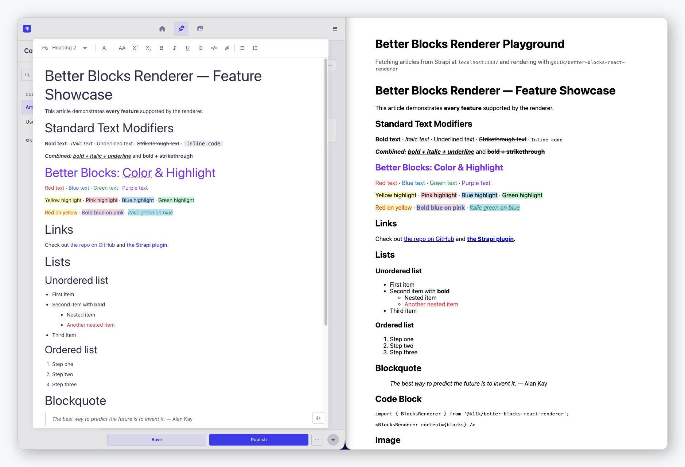

<h1 align="center">Better Blocks React Renderer</h1>

<p align="center">React renderer for Strapi v5 Blocks content — supports all standard blocks plus Better Blocks features: color, highlight, text alignment, nested lists, to-do lists, tables, media embeds, image captions, and more.</p>

<p align="center">
  <a href="https://www.npmjs.com/package/@qkix/better-blocks-react-renderer">
    
  </a>
  <a href="https://www.npmjs.com/package/@qkix/better-blocks-react-renderer">
    
  </a>
  <a href="https://github.com/qkix/strapi-plugins/blob/main/LICENSE">
    
  </a>
  <a href="https://buymeacoffee.com/k11k">
    
  </a>
</p>

<p align="center">
  
</p>

---

## Table of Contents

1. [Why?](#why)
2. [Compatibility](#compatibility)
3. [Installation](#installation)
4. [Usage](#usage)
5. [GitHub-style defaults](#tables-blockquotes--code-blocks-github-style)
6. [Supported Blocks](#supported-blocks)
7. [Supported Modifiers](#supported-modifiers)
8. [Custom Renderers](#custom-renderers)
9. [TypeScript](#typescript)
10. [Contributing](#contributing)
11. [Support this project](#support-this-project)
12. [License](#license)

---

## Why?

The official [`@strapi/blocks-react-renderer`](https://github.com/strapi/blocks-react-renderer) doesn't support the features that the [Better Blocks](https://github.com/qkix/strapi-plugins) plugin adds to the Strapi editor &mdash; color marks, text alignment, to-do lists, tables, media embeds, and more.

This package is a **drop-in replacement** that renders all Better Blocks features out of the box &mdash; no configuration needed.

## Compatibility

| Strapi Version | Renderer Version | React Version |
| -------------- | ---------------- | ------------- |
| v5.x           | v0.x             | &ge; 17       |

## Installation

```bash
# Using yarn
yarn add @qkix/better-blocks-react-renderer

# Using npm
npm install @qkix/better-blocks-react-renderer
```

**Peer dependencies:** `react >= 17`

## Usage

```tsx
import { BlocksRenderer } from '@qkix/better-blocks-react-renderer';

// Basic — renders all blocks including color/highlight
<BlocksRenderer content={blocks} />;
```

That's it. All Better Blocks features &mdash; colors, tables, to-do lists, media embeds, alignment, and more &mdash; work automatically.

### Math (KaTeX)

Math nodes are rendered with [KaTeX](https://katex.org/) &mdash; inline math becomes a `<span class="katex-inline">` and block math a `<div class="katex-block">`. Rendering happens via `katex.renderToString`, so it works in SSR and during static export with no client-side hydration step.

KaTeX needs its stylesheet to display correctly. Import it **once** in your app entry point:

```ts
import 'katex/dist/katex.min.css';
```

`katex` ships as a dependency of this package, so the stylesheet resolves without a separate install. If KaTeX fails to parse a formula, the renderer falls back to the raw LaTeX source instead of crashing.

### Diagrams (Mermaid)

Block-level `diagram` nodes (`format: 'mermaid'`) are rendered to inline SVG with [Mermaid](https://mermaid.js.org/) &mdash; flowcharts, sequence, class, state, ER, pie charts, and more.

Unlike KaTeX, Mermaid needs a real browser DOM to measure text, so it cannot render synchronously on the server. The renderer keeps SSR/static export safe by emitting the raw Mermaid source inside a `<pre class="mermaid-source">` on the server and during the first client render (so hydration matches), then swapping in the rendered `<div class="mermaid-diagram">` SVG after mount. If Mermaid fails to parse the source, the raw text stays in place as a graceful fallback.

`mermaid` ships as a dependency and is **lazy-loaded** the first time a diagram renders, so it stays out of your server bundle and only downloads on pages that actually use a diagram &mdash; no setup or stylesheet import required.

To render diagrams yourself (e.g. a different engine or custom theming), override the `diagram` block:

```tsx
<BlocksRenderer
  content={blocks}
  blocks={{
    diagram: ({ code, format }) => <MyDiagram code={code} format={format} />,
  }}
/>
```

### Callouts (Admonitions)

Block-level `callout` nodes render GitHub-style alerts in five variants &mdash; `note`, `tip`, `important`, `warning`, and `caution`. Each renders as an `<aside role="note">` with a colored left border, a title row (icon + label), and the nested block children (paragraphs, lists, links, etc.). If a `title` is set on the node it is used; otherwise the localized variant label is shown. Colors are applied inline, so there is no stylesheet to import.

To match your design system, override the `callout` block. It receives `variant`, `title`, and the already-rendered `children`:

```tsx
<BlocksRenderer
  content={blocks}
  blocks={{
    callout: ({ variant, title, children }) => (
      <div className={`alert alert-${variant}`}>
        {title && <h4>{title}</h4>}
        {children}
      </div>
    ),
  }}
/>
```

**Styling & dark mode.** The default markup carries stable classes &mdash; `bb-callout`, `bb-callout-{variant}`, `bb-callout-title`, and `bb-callout-icon` &mdash; which you can target for spacing, typography, radius, etc. The accent **colors are applied inline** (so the default works with zero setup), which means you can't recolor them with a plain CSS class. To re-theme colors &mdash; including a dark-mode palette &mdash; override the `callout` block and apply your own colors per `variant`:

```tsx
const ACCENT: Record<string, string> = {
  note: 'var(--cl-note, #4493f8)',
  tip: 'var(--cl-tip, #3fb950)',
  important: 'var(--cl-important, #ab7df8)',
  warning: 'var(--cl-warning, #d29922)',
  caution: 'var(--cl-caution, #f85149)',
};

<BlocksRenderer
  content={blocks}
  blocks={{
    callout: ({ variant, title, children }) => (
      <aside
        className={`callout callout-${variant}`}
        style={{ borderLeft: `4px solid ${ACCENT[variant]}` }}
      >
        <p style={{ color: ACCENT[variant], fontWeight: 600 }}>{title ?? variant}</p>
        {children}
      </aside>
    ),
  }}
/>;
```

Driving the accent from CSS variables (as above) lets you flip palettes with a `@media (prefers-color-scheme: dark)` or a `.dark` class rule on a parent.

### Details / Summary (Collapsible)

Block-level `details` nodes render a native, keyboard-accessible `<details>` / `<summary>` disclosure. The `summary` field is the plain-text label, the optional `defaultOpen` boolean maps to the HTML `open` attribute (honored on initial render so screen readers get the correct state), and `children` are block-level content (paragraphs, lists, tables, images, and nested `details`) rendered after the summary. The default markup carries stable `bb-details` and `bb-details-summary` classes for styling.

To match your design system, override the `details` block. It receives `summary`, `defaultOpen`, and the already-rendered `children`:

```tsx
<BlocksRenderer
  content={blocks}
  blocks={{
    details: ({ summary, defaultOpen, children }) => (
      <details open={defaultOpen} className="custom-details">
        <summary>{summary}</summary>
        {children}
      </details>
    ),
  }}
/>
```

### Buttons (CTA & File Download)

Block-level `button` nodes render a WordPress-style call-to-action. The `buttonType` selects the mode:

- **`link`** &mdash; renders `<a href={link.url} target={link.target} rel={link.rel} aria-label={link.ariaLabel}>{label}</a>`.
- **`file`** &mdash; renders a download link `<a href={file.url} download={file.name} aria-label="Download …">`, optionally prefixed with a file-type icon (`showFileIcon`) and suffixed with a human-readable size (`showFileSize`). Clicking force-downloads the file via a blob fetch (so renderable types like PDF/video/images download instead of opening inline, which the native `download` attribute can't guarantee). Set `filePreview: true` to instead open the file in a new tab (`target="_blank" rel="noopener noreferrer"`, no download) so users can preview it before saving.

**Cross-origin downloads.** Forcing a download only works for **same-origin** assets (e.g. Strapi's local upload provider) or cross-origin hosts that send CORS headers. For a cross-origin asset **without** CORS (some CDN / cloud upload providers), the browser blocks the blob fetch _and_ ignores the `download` attribute, so the renderer falls back to opening the file. This is a browser security limitation, not something a client-side renderer can work around &mdash; fix it on the server instead:

- Serve the asset with `Content-Disposition: attachment` (most reliable; then even a plain link downloads, no CORS needed).
- Enable CORS (`Access-Control-Allow-Origin`) on the asset host so the blob fetch can read the file.
- Proxy uploads through your site's own origin so they're same-origin.
- Or use a provider flag, e.g. Cloudinary `fl_attachment` or S3 `response-content-disposition`.

The `style` object is applied as inline CSS (`backgroundColor`, `color` &larr; `textColor`, `borderRadius`, `fontSize`, `fontWeight`, `padding`, `border`). The block is wrapped in a `<div className="bb-button-wrapper">` whose `text-align` honors `alignment` (`left` / `center` / `right`); `alignment: "none"` renders the button inline with no wrapper. A `cssClass` is appended to the default `bb-button` class.

**Hover colors.** `hoverBackgroundColor` / `hoverTextColor` work out of the box &mdash; no setup, no stylesheet import. The renderer ships a small `<style>` (emitted once, only when a default button is present) that wires the hover and `:focus-visible` states to the `--bb-button-hover-bg` / `--bb-button-hover-color` custom properties it sets from those fields. Buttons without hover colors keep their base colors on hover.

To customize the hover behavior, target `.bb-button:hover` yourself. Because the base colors are applied inline, your rule needs `!important` to win:

```css
.bb-button:hover {
  background-color: #3732c9 !important;
  color: #fff !important;
}
```

To fully control the markup, override the `button` block. It receives `label`, `buttonType`, `alignment`, `link`, `file`, `showFileSize`, `showFileIcon`, `filePreview`, `style`, and `cssClass`:

```tsx
<BlocksRenderer
  content={blocks}
  blocks={{
    button: ({ label, link, alignment }) => (
      <div className={`button-wrapper align-${alignment}`}>
        <a href={link?.url} target={link?.target} rel={link?.rel}>
          {label}
        </a>
      </div>
    ),
  }}
/>
```

### Social Embeds

Block-level `social-embed` nodes render a post from Twitter/X, Instagram, Facebook, TikTok, LinkedIn, or Pinterest. The renderer picks the embed HTML in priority order:

1. **`embedCode`** &mdash; a manual override pasted by the author, if present.
2. **`oembed.html`** &mdash; the markup the plugin fetched from the platform's oEmbed API at author time.
3. **Fallback link card** &mdash; when neither is available, a plain `<a>` link to the original post, enriched with the oEmbed `thumbnailUrl`, `title`, and `author` when present, so the block always links somewhere useful. The card's title is the oEmbed `title`, else `Post by {author}`, else `View on {providerName}` &mdash; and the provider subtitle is omitted in that last case, where it would only repeat the title. If the block has no `url` either (an author can save a manual `embedCode` without one), the same card renders as a `<div>` instead of an empty anchor.

The embed is wrapped in a `<figure className="bb-social-embed bb-social-embed-{platform} social-embed align-{alignment}">` (alignment defaults to `center`) with an `aria-label` describing it (`"{providerName} post by {author}"`), and the optional `caption` renders below it in a `<figcaption>`. Any `<iframe>` in the embed markup (e.g. LinkedIn) is given `loading="lazy"`.

**Widget scripts.** Twitter, Instagram, TikTok, Pinterest, and Facebook enhance their `<blockquote>`/`<div>` markup into a rich embed via a platform script (LinkedIn renders a self-contained `<iframe>` and needs none). The renderer loads the right script **once per platform** on mount and then re-runs the platform's processor (`twttr.widgets.load()`, `instgrm.Embeds.process()`, `tiktokEmbed.lib.render()`, `PinUtils.build()`, `FB.XFBML.parse()`) so freshly-mounted embeds get upgraded &mdash; including on remount and client-side navigation, when the script is long since loaded. This runs on the client only; on the server (and the first client render) the raw platform markup is emitted so SSR/hydration stay consistent.

Any `<script>` tag inside the embed markup is **stripped before injection**. Some providers (TikTok always, hand-pasted Instagram snippets often) ship their widget script inline in the payload, but a script inserted through `dangerouslySetInnerHTML` never executes &mdash; it would only sit in the DOM and defeat the loader's deduplication, leaving the embed permanently un-upgraded. The renderer injects the widget script itself instead, tagged with `data-bb-social-script="{platform}"`.

> **Trust boundary.** Apart from that `<script>` removal, the embed HTML is injected verbatim via `dangerouslySetInnerHTML` and is **not** sanitized &mdash; social embeds rely on `<iframe>`/`<blockquote>` markup that a sanitizer would strip. This markup originates from the platform's oEmbed API or a manual override entered by a trusted editor, so treat your CMS content as trusted. If you accept `social-embed` blocks from untrusted authors, sanitize on the server before storing.

To fully control the markup, override the `social-embed` block. It receives `platform`, `url`, `embedCode`, `oembed`, `alignment`, and `caption`:

```tsx
<BlocksRenderer
  content={blocks}
  blocks={{
    'social-embed': ({ platform, url, oembed, caption }) => (
      <figure className={`embed embed-${platform}`}>
        {oembed?.html ? (
          <div dangerouslySetInnerHTML={{ __html: oembed.html }} />
        ) : (
          <a href={url}>{oembed?.author ?? 'View post'}</a>
        )}
        {caption && <figcaption>{caption}</figcaption>}
      </figure>
    ),
  }}
/>
```

### Audio

Block-level `audio` nodes embed audio from the Strapi Media Library (or a raw URL) with a native HTML5 player. The player flags map 1:1 onto the `<audio>` element: `controls` (defaults to `true`), `autoplay`, `loop`, and `preload` (`none` / `metadata` / `auto`). `file.url` is rendered as-is &mdash; it is already backend-prefixed for Media-Library assets (same as the `image` and `button` blocks), so it is **not** re-prefixed.

The player is wrapped in a `<figure className="bb-audio align-{alignment}">` (alignment defaults to `center`; `left` / `center` / `right` place the player via flexbox, `none` stretches it full-width). An optional `title` renders above the player in a `<figcaption className="bb-audio-title">` and an optional `caption` below it in a `<figcaption className="bb-audio-caption">`. For accessibility the `<audio>` gets an `aria-label` (the `title`, falling back to `"Audio player"`) and, when a caption is present, an `aria-describedby` pointing at it; native HTML5 controls are keyboard-accessible. Inside the element, fallback text and a download link render for browsers/formats that can't play it.

Baseline appearance ships as inline styles (zero-config, no stylesheet import), and every element carries a stable `bb-audio*` class so you can restyle from your own CSS:

```css
.bb-audio {
  display: flex;
  flex-direction: column;
  gap: 0.5rem;
  margin: 1rem 0;
}
.bb-audio.align-left {
  align-items: flex-start;
}
.bb-audio.align-center {
  align-items: center;
}
.bb-audio.align-right {
  align-items: flex-end;
}
.bb-audio.align-none {
  align-items: stretch;
}
.bb-audio audio {
  width: 100%;
  max-width: 32rem;
}
.bb-audio.align-none audio {
  max-width: 100%;
}
.bb-audio-title {
  font-weight: 600;
}
.bb-audio-caption {
  font-size: 0.875rem;
  color: #6b7280;
}
```

To fully control the markup, override the `audio` block. It receives `file`, `title`, `caption`, `player`, and `alignment`:

```tsx
<BlocksRenderer
  content={blocks}
  blocks={{
    audio: ({ file, title, caption, player, alignment = 'center' }) => (
      <figure className={`bb-audio align-${alignment}`}>
        {title && <figcaption className="bb-audio-title">{title}</figcaption>}
        <audio
          src={file.url}
          controls={player.controls}
          autoPlay={player.autoplay}
          loop={player.loop}
          preload={player.preload}
          aria-label={title || 'Audio player'}
        >
          Your browser does not support the audio element. <a href={file.url}>Download the audio</a>
          .
        </audio>
        {caption && <figcaption className="bb-audio-caption">{caption}</figcaption>}
      </figure>
    ),
  }}
/>
```

### Embeds (iframes)

Block-level `embed` nodes render an iframe from a share URL (YouTube, Vimeo, Loom, Wistia, Dailymotion, api.video) or from raw embed code the author pasted. The node carries a ready-to-render `embedHtml` field, and that is the **only** field the renderer needs &mdash; `url` and `iframe` exist purely to round-trip the editor UI and are ignored.

The markup is wrapped in a `<figure className="bb-embed align-{alignment}">` (alignment defaults to `center`; `left` / `center` / `right` place the box via flexbox, `none` stretches it full-width) containing a `<div className="bb-embed-frame">` that carries the CSS `aspect-ratio`. `aspectRatio` converts by replacing `:` with `/` (`"16:9"` → `16 / 9`); when it is `"custom"` the `customAspectRatio` value is used verbatim, and anything missing falls back to `16 / 9`. The optional `caption` renders below in a `<figcaption className="bb-embed-caption">`, and `title` becomes the figure's `aria-label` (it is already baked into the iframe's `title` attribute for URL-derived embeds). An embed whose source was cleared degrades to a plain link to `url` rather than vanishing.

> **Trust boundary.** `embedHtml` is injected with `dangerouslySetInnerHTML`. The plugin sanitizes it at author time &mdash; the iframe is rebuilt from an attribute allowlist over an **https-only** `src`, with scripts, event handlers, inline styles and unknown attributes stripped, and `allow` filtered to a safe permission set &mdash; so treat your CMS content as trusted. If you accept `embed` blocks from untrusted authors, sanitize on the server before storing, or override the block (below) and render the parsed parts instead of the HTML.

Consumers need to allow the embed hosts in their `frame-src` (and `img-src` for thumbnails) CSP directives &mdash; see the [plugin README](https://github.com/qkix/strapi-plugins#embed-json-shape-for-frontend-renderers) for the host list.

Baseline appearance ships as inline styles plus one small stylesheet (injected only when a default embed renders, since inline styles can't reach into injected markup). Every element carries a stable `bb-embed*` class:

```css
.bb-embed-frame {
  overflow: hidden;
}
.bb-embed-frame iframe {
  width: 100%;
  height: 100%;
  border: 0;
  display: block;
}
```

To render the parsed parts yourself &mdash; a privacy-friendly click-to-play using `thumbnail`, say, or a provider-specific component &mdash; override the `embed` block. It receives `source`, `url`, `iframe`, `embedHtml`, `embedSrc`, `provider`, `thumbnail`, `aspectRatio`, `customAspectRatio`, `alignment`, `caption`, and `title`:

```tsx
<BlocksRenderer
  content={blocks}
  blocks={{
    embed: ({ embedSrc, provider, thumbnail, title, caption }) => (
      <figure className={`embed embed-${provider}`}>
        <ClickToPlay src={embedSrc} poster={thumbnail} title={title} />
        {caption && <figcaption>{caption}</figcaption>}
      </figure>
    ),
  }}
/>
```

### Video

Block-level `video` nodes render a provider-aware player. Direct file URLs (`provider: "local"` from the Media Library, or `"custom"`) use a native HTML5 `<video>`, with the nested `player` flags mapped 1:1 (`controls` defaults to `true`; `autoplay`, `loop`, `muted` default to `false`). A `transcript` URL becomes a `<track kind="captions">`, `poster` shows before playback, and the layout follows the same `alignment` / `aspectRatio` rules as [Embeds](#embeds-iframes) &mdash; a `<figure className="bb-video align-{alignment}">` holding a `<div className="bb-video-frame">`. The optional `title` renders above in a `<figcaption className="bb-video-title">` (and as the player's `aria-label`), the `caption` below in a `<figcaption className="bb-video-caption">` linked via `aria-describedby`.

**HLS / DASH.** Mux and friends serve `.m3u8` (HLS) or `.mpd` (DASH) manifests, which a bare `<video>` only plays in Safari and iOS WebKit. This package takes **no streaming dependency** &mdash; it would cost every consumer bundle size for a block most pages don't use &mdash; and instead upgrades playback opportunistically when you provide a player:

| You provide                                                                                                      | Result                                                            |
| ---------------------------------------------------------------------------------------------------------------- | ----------------------------------------------------------------- |
| [`@mux/mux-player`](https://www.npmjs.com/package/@mux/mux-player) (registers the `<mux-player>` custom element) | `provider: "mux"` nodes with a `playbackId` render `<mux-player>` |
| [`hls.js`](https://www.npmjs.com/package/hls.js) exposed as `window.Hls`                                         | `.m3u8` sources attach hls.js on mount and play everywhere        |
| Nothing                                                                                                          | Native playback (works in Safari), `poster` elsewhere             |

Both are detected at runtime, so nothing extra is bundled when you don't use them. `<mux-player>` is watched via `customElements.whenDefined`, so a player registered by an async side-effect import still takes over once it lands. Wiring up hls.js is a one-liner in your app entry:

```tsx
import Hls from 'hls.js';

window.Hls = Hls;
```

For Mux, a `playbackId` is all the frontend needs for a **public** playback policy &mdash; no credentials. Signed-policy assets aren't selectable in the editor, since they need a short-lived JWT minted per request.

To fully control the player, override the `video` block. It receives `provider`, `url`, `assetId`, `playbackId`, `file`, `poster`, `title`, `caption`, `transcript`, `player`, `alignment`, `aspectRatio`, and `customAspectRatio`:

```tsx
import MuxPlayer from '@mux/mux-player-react';

<BlocksRenderer
  content={blocks}
  blocks={{
    video: ({ provider, url, playbackId, poster, title, caption }) => (
      <figure className="video">
        {provider === 'mux' && playbackId ? (
          <MuxPlayer playbackId={playbackId} poster={poster} metadata={{ video_title: title }} />
        ) : (
          <video src={url} poster={poster} controls />
        )}
        {caption && <figcaption>{caption}</figcaption>}
      </figure>
    ),
  }}
/>;
```

> **Deprecated:** the older `media-embed` block (`{ type: "media-embed", url, originalUrl }`) is no longer inserted by the editor &mdash; the toolbar's media button now creates an `embed` node &mdash; but the renderer keeps handling it so content authored before the `embed` block still displays.

### Tables

Tables render as semantic HTML. Every **leading row whose cells are all `table-header-cell`** is a header row: those rows render inside `<thead>` with each cell as `<th scope="col">`, and the rest go in `<tbody>`. A row of any other shape ends the header, so a table that doesn't start with header cells stays entirely in `<tbody>`. A `table-header-cell` that appears in a body row is a row header and gets `scope="row"`.

Cells carry three optional properties, each with a "cheapest" default the editor omits:

| Property  | Values                    | Absent means        |
| --------- | ------------------------- | ------------------- |
| `align`   | `left`, `center`, `right` | `left` (no `style`) |
| `colSpan` | integer ≥ 1               | `1` (no attribute)  |
| `rowSpan` | integer ≥ 1               | `1` (no attribute)  |

`align` is applied as inline `text-align`; the spans map straight onto the HTML attributes of the same name. Merged cells follow hand-written HTML rules &mdash; a spanned-over slot has no node at all, so rows and cells render in document order with no grid reconstruction.

A merged header with a `rowSpan` grouping in the body &mdash; `Region` and `Team` span both header rows, `Half-year totals` spans its two sub-columns, and `North` spans the two rows below it:

```json
{
  "type": "table",
  "children": [
    {
      "type": "table-row",
      "children": [
        {
          "type": "table-header-cell",
          "rowSpan": 2,
          "children": [{ "type": "text", "text": "Region" }]
        },
        {
          "type": "table-header-cell",
          "rowSpan": 2,
          "children": [{ "type": "text", "text": "Team" }]
        },
        {
          "type": "table-header-cell",
          "colSpan": 2,
          "align": "center",
          "children": [{ "type": "text", "text": "Half-year totals" }]
        }
      ]
    },
    {
      "type": "table-row",
      "children": [
        {
          "type": "table-header-cell",
          "align": "center",
          "children": [{ "type": "text", "text": "Q3" }]
        },
        {
          "type": "table-header-cell",
          "align": "center",
          "children": [{ "type": "text", "text": "Q4" }]
        }
      ]
    },
    {
      "type": "table-row",
      "children": [
        { "type": "table-cell", "rowSpan": 2, "children": [{ "type": "text", "text": "North" }] },
        { "type": "table-cell", "children": [{ "type": "text", "text": "Alpha" }] },
        { "type": "table-cell", "align": "center", "children": [{ "type": "text", "text": "12" }] },
        { "type": "table-cell", "align": "center", "children": [{ "type": "text", "text": "18" }] }
      ]
    },
    {
      "type": "table-row",
      "children": [
        { "type": "table-cell", "children": [{ "type": "text", "text": "Beta" }] },
        { "type": "table-cell", "align": "center", "children": [{ "type": "text", "text": "9" }] },
        { "type": "table-cell", "align": "center", "children": [{ "type": "text", "text": "14" }] }
      ]
    }
  ]
}
```

renders as:

```html
<table class="bb-table">
  <thead>
    <tr>
      <th scope="col" rowspan="2">Region</th>
      <th scope="col" rowspan="2">Team</th>
      <th scope="col" colspan="2" style="text-align: center">Half-year totals</th>
    </tr>
    <tr>
      <th scope="col" style="text-align: center">Q3</th>
      <th scope="col" style="text-align: center">Q4</th>
    </tr>
  </thead>
  <tbody>
    <tr>
      <td rowspan="2">North</td>
      <td>Alpha</td>
      <td style="text-align: center">12</td>
      <td style="text-align: center">18</td>
    </tr>
    <tr>
      <td>Beta</td>
      <td style="text-align: center">9</td>
      <td style="text-align: center">14</td>
    </tr>
  </tbody>
</table>
```

Note that the second header row holds only two cells and the `Beta` row only three &mdash; the slots covered by a `rowSpan` above them carry no node.

Cell `children` go through the same inline renderer as paragraphs, so marks (`bold`, `italic`, `underline`, `strikethrough`, `code`, `color`, `backgroundColor`), links, and inline math all work inside cells.

```jsx
<BlocksRenderer
  content={content}
  blocks={{
    'table-cell': ({ children, align, colSpan, rowSpan, style }) => (
      <td className="my-td" colSpan={colSpan} rowSpan={rowSpan} style={style} data-align={align}>
        {children}
      </td>
    ),
  }}
/>
```

### Tables, Blockquotes & Code Blocks (GitHub-style)

These three blocks ship with GitHub-flavored defaults out of the box &mdash; no stylesheet to import. Each carries a stable `bb-*` class, and the styles are injected as a `<style>` tag only when the block actually appears in the content (and skipped entirely when you override the block). Everything is rethemable through CSS custom properties, so you can restyle without replacing any markup.

The same classes and custom properties are used by the [Astro renderer](https://github.com/qkix/strapi-plugins/tree/main/packages/better-blocks-astro-renderer), so one shared theme covers both.

| Block   | Default element                 | Custom properties                                                                        |
| ------- | ------------------------------- | ---------------------------------------------------------------------------------------- |
| `table` | `<table class="bb-table">`      | `--bb-table-border`, `--bb-table-header-bg`, `--bb-table-row-bg`, `--bb-table-stripe-bg` |
| `quote` | `<blockquote class="bb-quote">` | `--bb-quote-border`, `--bb-quote-fg`                                                     |
| `code`  | `<div class="bb-code">`         | `--bb-code-fallback-bg`, `--bb-code-fallback-fg`, `--bb-code-copy-*`                     |

**Tables** get bordered cells, a shaded header, zebra-striped body rows, and horizontal scrolling on overflow. See [Tables](#tables) for the `<thead>` / `<tbody>` rules and cell properties.

**Blockquotes** get a muted left border with indented, dimmed text &mdash; GitHub's markdown quote, which has no background fill.

**Code blocks** are syntax-highlighted with [Shiki](https://shiki.style/), driven by the `language` the editor stores on the block:

```json
{
  "type": "code",
  "language": "typescript",
  "children": [{ "type": "text", "text": "const x: number = 1;" }]
}
```

Shiki needs to resolve grammars asynchronously, so &mdash; like [diagrams](#diagrams-mermaid) &mdash; highlighting happens on the client. The server render and first paint emit the raw source in a plain `<pre class="bb-code-pre">` so hydration matches, then the highlighted markup swaps in after mount:

```html
<!-- before hydration -->
<div class="bb-code">
  <pre class="bb-code-pre"><code>const x: number = 1;</code></pre>
</div>

<!-- after -->
<div class="bb-code">
  <div>
    <pre class="shiki github-dark" style="…"><code>…</code></pre>
  </div>
</div>
```

If Shiki fails to load, the plain `<pre>` simply stays. Language values are mapped to Shiki grammar ids (`objectivec` → `objective-c`, `fortran` → `fortran-free-form`, `vbnet` → `vb`, …); an unknown or missing language falls back to `plaintext`, rendered themed but unhighlighted, so a stray value never breaks the page.

Two props control the defaults:

| Prop             | Default         | Description                                                    |
| ---------------- | --------------- | -------------------------------------------------------------- |
| `codeTheme`      | `'github-dark'` | Any bundled Shiki theme (`github-light`, `dracula`, `nord`, …) |
| `codeCopyButton` | `false`         | Adds a "Copy" button in the top-right corner                   |

```jsx
<BlocksRenderer content={content} codeTheme="github-light" codeCopyButton />
```

Because the pre-hydration `<pre>` has no theme colors of its own, it defaults to the `github-dark` palette. If you change `codeTheme`, set the fallback colors to match so the swap isn't jarring:

```css
:root {
  --bb-code-fallback-bg: #fff;
  --bb-code-fallback-fg: #24292f;
}
```

Both props are ignored when you supply your own `code` renderer, which receives the raw editor `language` (not the Shiki grammar id) so it can map it however it likes:

```jsx
<BlocksRenderer
  content={content}
  blocks={{
    code: ({ plainText, language }) => <Prism code={plainText} language={language} />,
  }}
/>
```

### Astro

`BlocksRenderer` works in [Astro](https://astro.build/) via the [`@astrojs/react`](https://docs.astro.build/en/guides/integrations-guide/react/) integration. Because the renderer is purely presentational and KaTeX renders to a string on the server (see [Math (KaTeX)](#math-katex)), you can render it as a static [Astro island](https://docs.astro.build/en/concepts/islands/) with **no client directive** &mdash; Astro outputs plain HTML and ships zero JavaScript:

```astro
---
import { BlocksRenderer } from '@qkix/better-blocks-react-renderer';
// Import the KaTeX stylesheet once (e.g. in a shared layout) so math displays correctly.
import 'katex/dist/katex.min.css';

const { blocks } = Astro.props;
---

<BlocksRenderer content={blocks} />
```

You only need a client directive (`client:load`, `client:visible`, etc.) if you pass **interactive** custom renderers &mdash; for example a to-do `list-item` with a working checkbox, or a custom `math` renderer that hydrates on the client. Static content (including server-rendered KaTeX) needs no hydration:

```astro
---
import { BlocksRenderer } from '@qkix/better-blocks-react-renderer';
const { blocks } = Astro.props;
---

<!-- Use a client directive only when your custom renderers need to run in the browser -->
<BlocksRenderer content={blocks} client:visible />
```

> **Note:** When you hydrate with a client directive, custom renderers passed as props must be serializable references (e.g. imported components), since Astro serializes island props. Keep inline closures for the static (no-directive) case.

## Supported Blocks

| Block                           | Default element                 | Source                      |
| ------------------------------- | ------------------------------- | --------------------------- |
| `paragraph`                     | `<p>`                           | Strapi core                 |
| `heading` (1&ndash;6)           | `<h1>`&ndash;`<h6>`             | Strapi core                 |
| `list` (ordered/unordered/todo) | `<ol>` / `<ul>`                 | Strapi core + Better Blocks |
| `list-item`                     | `<li>`                          | Strapi core                 |
| `link`                          | `<a>`                           | Strapi core                 |
| `quote`                         | `<blockquote class="bb-quote">` | Strapi core                 |
| `code`                          | `<pre><code>` (Shiki)           | Strapi core                 |
| `image`                         | `<figure>`                 | Strapi core                 |
| `horizontal-line`               | `<hr>`                          | Better Blocks               |
| `table`                         | `<table class="bb-table">`      | Better Blocks               |
| `table-header-cell`             | `<th scope="col">`              | Better Blocks               |
| `table-cell`                    | `<td>`                          | Better Blocks               |
| `media-embed` (deprecated)      | `<iframe>` (16:9)               | Better Blocks               |
| `embed` (iframe)                | `<figure><iframe>`              | Better Blocks               |
| `video`                         | `<figure><video>`               | Better Blocks               |
| `math` (inline/block)           | `<span>` / `<div>`              | Better Blocks               |
| `diagram` (mermaid)             | `<div>` (SVG)                   | Better Blocks               |
| `callout` (admonition)          | `<aside>`                       | Better Blocks               |
| `details` (collapsible)         | `<details>`                     | Better Blocks               |
| `button` (CTA / file download)  | `<a>`                           | Better Blocks               |
| `social-embed`                  | `<figure>`                      | Better Blocks               |
| `audio`                         | `<figure><audio>`               | Better Blocks               |

### Block properties

| Property            | Applies to                    | Description                                                                                            |
| ------------------- | ----------------------------- | ------------------------------------------------------------------------------------------------------ |
| `textAlign`         | paragraph, heading, quote     | Text alignment (`left`, `center`, `right`, `justify`)                                                  |
| `lineHeight`        | paragraph, heading, quote     | CSS line-height value (e.g. `1.5`, `2.0`)                                                              |
| `indent`            | paragraph, heading, quote     | Block indentation level (`marginLeft: N * 2rem`)                                                       |
| `indentLevel`       | list                          | Cycling list-style-type per nesting depth                                                              |
| `format`            | list                          | `ordered`, `unordered`, or `todo`                                                                      |
| `checked`           | list-item (in todo lists)     | Checkbox state (`true`/`false`)                                                                        |
| `target`            | link                          | `_blank` for new-tab links                                                                             |
| `rel`               | link                          | `noopener noreferrer` for new-tab links                                                                |
| `caption`           | image                         | Text displayed below the image                                                                         |
| `imageAlign`        | image                         | Image alignment (`left`, `center`, `right`)                                                            |
| `language`          | code                          | Shiki grammar for syntax highlighting (e.g. `typescript`, `python`); falls back to `plaintext`         |
| `align`             | table-cell, table-header-cell | Cell text alignment (`left` when absent, `center`, `right`)                                            |
| `colSpan`           | table-cell, table-header-cell | HTML `colspan` (`1` when absent)                                                                       |
| `rowSpan`           | table-cell, table-header-cell | HTML `rowspan` (`1` when absent)                                                                       |
| `url`               | media-embed                   | Embed URL (YouTube/Vimeo iframe src)                                                                   |
| `originalUrl`       | media-embed                   | Original user-provided URL                                                                             |
| `format`            | math                          | `inline` (`<span>`) or `block` (`<div>`)                                                               |
| `value`             | math                          | LaTeX source rendered with KaTeX                                                                       |
| `format`            | diagram                       | `mermaid`                                                                                              |
| `value`             | diagram                       | Mermaid source rendered to SVG                                                                         |
| `summary`           | details                       | Plain-text label for the `<summary>`                                                                   |
| `defaultOpen`       | details                       | Open on initial render (HTML `open` attribute)                                                         |
| `buttonType`        | button                        | `link` or `file` (download) mode                                                                       |
| `label`             | button                        | Visible button text                                                                                    |
| `alignment`         | button                        | `left`, `center`, `right`, or `none` (inline)                                                          |
| `link`              | button (link mode)            | `{ url, target, rel, ariaLabel }`                                                                      |
| `file`              | button (file mode)            | `{ url, name, size, ext, mime }` for download                                                          |
| `showFileIcon`      | button (file mode)            | Prefix the label with a file-type icon                                                                 |
| `showFileSize`      | button (file mode)            | Suffix the label with a human-readable size                                                            |
| `filePreview`       | button (file mode)            | `true` opens the file in a new tab instead of downloading                                              |
| `style`             | button                        | Inline CSS + hover custom properties                                                                   |
| `cssClass`          | button                        | Extra class appended to `bb-button`                                                                    |
| `platform`          | social-embed                  | `twitter`, `instagram`, `facebook`, `tiktok`, `linkedin`, `pinterest`                                  |
| `url`               | social-embed                  | Original post URL, optional (used by the fallback link card)                                           |
| `embedCode`         | social-embed                  | Optional manual HTML override (highest priority)                                                       |
| `oembed`            | social-embed                  | Fetched oEmbed payload `{ html, title, author, authorUrl, thumbnailUrl, providerName, width, height }` |
| `alignment`         | social-embed                  | `left`, `center` (default), or `right`                                                                 |
| `caption`           | social-embed                  | Optional caption rendered in a `<figcaption>`                                                          |
| `file`              | audio                         | `{ url, name, ext, hash, mime, size, provider, duration }` &mdash; `url` is rendered as the `src`      |
| `player`            | audio                         | `{ controls (default true), autoplay, loop, preload }` &mdash; mapped 1:1 onto `<audio>`               |
| `title`             | audio                         | Optional title rendered above the player (also used as the `aria-label`)                               |
| `caption`           | audio                         | Optional caption rendered below the player in a `<figcaption>`                                         |
| `alignment`         | audio                         | `left`, `center` (default), `right`, or `none` (full-width)                                            |
| `embedHtml`         | embed                         | Plugin-sanitized iframe markup &mdash; the only field needed to render                                 |
| `embedSrc`          | embed                         | The iframe's `src`, hoisted for host/CSP checks                                                        |
| `provider`          | embed                         | `youtube`, `vimeo`, `loom`, `wistia`, `dailymotion`, `api-video`, or `generic`                         |
| `thumbnail`         | embed                         | Poster image, when the provider exposes one (used by custom renderers)                                 |
| `source`            | embed                         | `url` or `iframe` &mdash; which input the author used                                                  |
| `url`               | embed                         | Original share URL, also the fallback link when `embedHtml` is absent                                  |
| `title`             | embed                         | Accessible name (already baked into `embedHtml` for URL-derived embeds)                                |
| `provider`          | video                         | `local`, `mux`, `api-video`, `cloudinary`, or `custom`                                                 |
| `url`               | video                         | Playback URL &mdash; a direct file, or an HLS/DASH manifest                                            |
| `playbackId`        | video                         | Provider playback id (`<mux-player playback-id>` for Mux)                                              |
| `poster`            | video                         | Thumbnail shown before playback                                                                        |
| `transcript`        | video                         | WebVTT URL rendered as `<track kind="captions">`                                                       |
| `player`            | video                         | `{ controls (default true), autoplay, loop, muted }` &mdash; mapped 1:1 onto `<video>`                 |
| `alignment`         | embed, video                  | `left`, `center` (default), `right`, or `none` (full-width)                                            |
| `aspectRatio`       | embed, video                  | `16:9`, `21:9`, `4:3`, `1:1`, or `custom` &mdash; CSS `aspect-ratio` on the frame                      |
| `customAspectRatio` | embed, video                  | Free-form `width / height`, used when `aspectRatio` is `custom`                                        |
| `caption`           | embed, video                  | Optional caption rendered in a `<figcaption>`                                                          |

## Supported Modifiers

| Modifier          | Default element                    | Source        |
| ----------------- | ---------------------------------- | ------------- |
| `bold`            | `<strong>`                         | Strapi core   |
| `italic`          | `<em>`                             | Strapi core   |
| `underline`       | `<span>`                           | Strapi core   |
| `strikethrough`   | `<del>`                            | Strapi core   |
| `code`            | `<code>`                           | Strapi core   |
| `uppercase`       | `<span style={{textTransform}}>`   | Better Blocks |
| `superscript`     | `<sup>`                            | Better Blocks |
| `subscript`       | `<sub>`                            | Better Blocks |
| `color`           | `<span style={{color}}>`           | Better Blocks |
| `backgroundColor` | `<span style={{backgroundColor}}>` | Better Blocks |
| `fontFamily`      | `<span style={{fontFamily}}>`      | Better Blocks |
| `fontSize`        | `<span style={{fontSize}}>`        | Better Blocks |

## Custom Renderers

### Custom block renderers

Override any block type with your own component:

```tsx
<BlocksRenderer
  content={blocks}
  blocks={{
    paragraph: ({ children, style }) => (
      <p className="my-paragraph" style={style}>
        {children}
      </p>
    ),
    heading: ({ children, level, style }) => {
      const Tag = `h${level}`;
      return <Tag style={style}>{children}</Tag>;
    },
    link: ({ children, url, target, rel }) => (
      <a href={url} target={target} rel={rel}>
        {children}
      </a>
    ),
    image: ({ image, caption, imageAlign }) => (
      <figure style={{ textAlign: imageAlign }}>
        
        {caption && <figcaption>{caption}</figcaption>}
      </figure>
    ),
    'list-item': ({ children, checked }) =>
      checked !== undefined ? (
        <li style={{ listStyle: 'none' }}>
          <input type="checkbox" checked={checked} readOnly /> {children}
        </li>
      ) : (
        <li>{children}</li>
      ),
    'horizontal-line': () => <hr className="my-divider" />,
    quote: ({ children, style }) => (
      <blockquote className="my-quote" style={style}>
        {children}
      </blockquote>
    ),
    // `language` is the raw editor value, not the Shiki grammar id
    code: ({ plainText, language }) => <Prism code={plainText} language={language} />,
    table: ({ children }) => <table className="my-table">{children}</table>,
    'table-header-cell': ({ children, colSpan, rowSpan, style }) => (
      <th className="my-th" scope="col" colSpan={colSpan} rowSpan={rowSpan} style={style}>
        {children}
      </th>
    ),
    'table-cell': ({ children, colSpan, rowSpan, style }) => (
      <td className="my-td" colSpan={colSpan} rowSpan={rowSpan} style={style}>
        {children}
      </td>
    ),
    'media-embed': ({ url }) => (
      <div className="video-wrapper">
        <iframe src={url} allowFullScreen title="Embedded media" />
      </div>
    ),
    // Bring your own math engine (e.g. MathJax) instead of the built-in KaTeX
    math: ({ formula, inline }) =>
      inline ? <MyInlineMath formula={formula} /> : <MyBlockMath formula={formula} />,
    // Bring your own diagram engine instead of the built-in Mermaid
    diagram: ({ code, format }) => <MyDiagram code={code} format={format} />,
    'social-embed': ({ platform, url, oembed, caption }) => (
      <MySocialEmbed platform={platform} url={url} oembed={oembed} caption={caption} />
    ),
    // Render the parsed parts instead of injecting the stored embed HTML
    embed: ({ embedSrc, provider, thumbnail, title }) => (
      <MyClickToPlay src={embedSrc} provider={provider} poster={thumbnail} title={title} />
    ),
    // Bring your own streaming player instead of the built-in detection
    video: ({ provider, url, playbackId, poster }) => (
      <MyVideoPlayer provider={provider} src={url} playbackId={playbackId} poster={poster} />
    ),
  }}
/>
```

### Custom modifier renderers

Override any text modifier with your own component:

```tsx
<BlocksRenderer
  content={blocks}
  modifiers={{
    bold: ({ children }) => <strong className="font-bold">{children}</strong>,
    color: ({ children, color }) => <span style={{ color }}>{children}</span>,
    backgroundColor: ({ children, backgroundColor }) => (
      <mark style={{ backgroundColor }}>{children}</mark>
    ),
  }}
/>
```

## TypeScript

All types are exported:

```ts
import type {
  BlocksContent,
  BlocksRendererProps,
  BlockNode,
  TextNode,
  LinkNode,
  ListNode,
  ListItemNode,
  ParagraphNode,
  HeadingNode,
  QuoteNode,
  CodeNode,
  ImageNode,
  HorizontalLineNode,
  TableNode,
  TableRowNode,
  TableCellNode,
  TableHeaderCellNode,
  TableCellAlign,
  MediaEmbedNode,
  MathNode,
  DiagramNode,
  SocialEmbedNode,
  SocialPlatform,
  SocialEmbedAlignment,
  SocialEmbedOembed,
  AudioNode,
  AudioFile,
  AudioPlayer,
  AudioPreload,
  AudioAlignment,
  EmbedNode,
  EmbedProvider,
  VideoNode,
  VideoProvider,
  VideoPlayer,
  VideoFile,
  MediaAlignment,
  AspectRatio,
  TextAlign,
  CustomBlocksConfig,
  CustomModifiersConfig,
} from '@qkix/better-blocks-react-renderer';
```

## Contributing

Contributions are welcome! This package lives in the
[strapi-plugin-better-blocks](https://github.com/qkix/strapi-plugins)
monorepo, next to the Strapi plugin and the Astro renderer. The easiest way to
get started is with Docker:

```bash
git clone https://github.com/qkix/strapi-plugins.git
cd strapi-plugin-better-blocks

docker compose up --build
```

That brings up a Strapi v5 instance running the Better Blocks plugin, seeded
with the showcase articles, plus both renderers displaying the same content.

- **Strapi admin:** http://localhost:1337/admin (login: `admin@example.com` / `admin12#`)
- **React example:** http://localhost:5173
- **Astro example:** http://localhost:4321

### Development workflow

1. Make changes to the renderer source in `packages/better-blocks-react-renderer/src/`
2. Rebuild with `docker compose up --build` — the renderer is compiled into the image
3. Editing `examples/react-app/src/` hot-reloads on its own, with no rebuild

### Without Docker

```bash
pnpm install
pnpm build   # the core, this renderer and the plugin

pnpm --filter @qkix/example-strapi-app develop
pnpm --filter @qkix/example-react-app dev   # in another terminal
```

### Running tests

```bash
pnpm test        # every package, from the repo root
pnpm typecheck
pnpm lint

pnpm --filter @qkix/better-blocks-react-renderer test   # just this one
```

## Community & Support

- [GitHub Issues](https://github.com/qkix/strapi-plugins/issues) &mdash; Bug reports and feature requests

## Support this project

This package is built and maintained in my free time, and it's free for everyone. If it has saved you time on a project, you can help keep it caffeinated and actively developed:

<a href="https://buymeacoffee.com/k11k">
  
</a>

Every coffee goes toward fixing bugs, reviewing PRs, writing docs, and shipping the features you ask for. Thank you! &#9749;

## Related

- [@qkix/strapi-plugin-better-blocks](https://github.com/qkix/strapi-plugins) &mdash; Strapi plugin that extends the Blocks editor with colors, tables, to-do lists, media embeds, and more
- [@strapi/blocks-react-renderer](https://github.com/strapi/blocks-react-renderer) &mdash; Official Strapi renderer (standard blocks only)

## License

[MIT License](LICENSE) &copy; [qkix](https://github.com/qkix)
